# saude/ — CLAUDE.md

## Visão geral

Cada subpasta de `saude/` (ex.: `al/`, `lc/`) representa uma pessoa e uma lista de queixas de saúde. A pasta gera uma página educativa vanilla (`index.html` — HTML/CSS/JS num único arquivo, sem build, sem framework, sem CDN) sobre essas queixas, incluindo — quando há mais de uma queixa na mesma pasta — uma seção sobre como elas interagem entre si (comorbidade, sobreposição de sintomas, cuidados de medicação).

Este fluxo soma dois padrões de outros projetos do usuário:

- Rigor de pesquisa/escrita/revisão de `artigo_pbit/.claude/commands` (taxonomia epistêmica Evidência/Inferência/Hipótese, revisão crítica com `pontos.md` acionável).
- Disciplina de dev/build/review de `tarefas/.claude/commands` (separação dados/render/estilo, DRY a partir da 3ª ocorrência, lições da era vanilla do projeto — ver `dev.md`).

## Estrutura por pasta

```
saude/<pasta>/
  topicos.txt     — input: uma queixa por linha (nunca editado pelas skills, só pelo usuário)
  pesquisa.md      — output de /pesquisar: achados por queixa + interações, com fonte e nível epistêmico
  index.html       — output de /escrever: página final, vanilla, autocontida
  pontos.md        — output de /revisar: pendências acionáveis pra próxima rodada de /escrever
```

## Skills (`saude/.claude/commands/`)

| Skill | Uso | Faz |
|---|---|---|
| `dev.md` | (referência, não roda sozinha) | Princípios SRP/DRY/vanilla que `escrever`/`revisar` aplicam |
| `pesquisar.md` | `/pesquisar <pasta>` | Pesquisa fontes confiáveis por queixa + interações entre queixas da mesma pasta |
| `escrever.md` | `/escrever <pasta>` | Gera/atualiza `index.html` a partir de `pesquisa.md` (e `pontos.md`, se houver) |
| `revisar.md` | `/revisar <pasta>` | Revisão crítica do `index.html`, exporta `pontos.md` |
| `loop.md` | `/loop <pasta>` | Orquestra pesquisar → escrever → revisar (com 1 repetição se sobrar item crítico/alto), sem commit/push |

## Fluxo

```mermaid
flowchart TD
    A[topicos.txt] --> B["/pesquisar &lt;pasta&gt;"]
    B --> C[pesquisa.md]
    C --> D["/escrever &lt;pasta&gt;"]
    P[pontos.md existente?] -.entrada opcional.-> D
    D --> E[index.html]
    E --> F["/revisar &lt;pasta&gt;"]
    F --> G[pontos.md]
    G --> H{Crítico ou Alto&#10;e 1ª volta?}
    H -- sim --> D
    H -- não --> I[Fim do ciclo]

    subgraph L ["/loop pasta — orquestrador"]
        B
        D
        F
        H
    end
```



`/loop <pasta>` é o ponto de entrada pensado para uso recorrente: pode ser chamado por um `/loop` de intervalo nativo ou por agendamento (`ScheduleWakeup`/cron) quando `topicos.txt` ganhar novas queixas no futuro. Ele mesmo verifica (Passo 0 de `loop.md`) se há algo novo antes de repesquisar/reescrever — rodar sem mudança nenhuma é barato.

## Regras de segurança

- Nenhuma skill aqui prescreve dose ou decisão de tratamento — sempre encaminha ao médico/psiquiatra/endocrinologista responsável.
- Todo `index.html` carrega um aviso de rodapé: conteúdo educativo, não substitui acompanhamento profissional.
- `topicos.txt` só é editado pelo usuário — as skills leem, nunca escrevem nele.
- Nada aqui toca `tarefas/`, `tarefas-app/` ou o `index.html`/`CNAME`/`README.md` da raiz do repositório (site "TechEcode", não relacionado).
